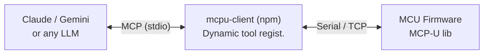
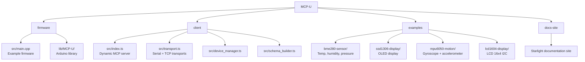

# MCP/U

**The Unified Interface for AI-Ready Microcontrollers**

[](LICENSE)
[](https://www.npmjs.com/package/mcpu-client)
[](https://platformio.org)
[](https://www.arduino.cc)

> Transform any Arduino-compatible MCU into an AI-controllable device via the Model Context Protocol.

*By [2edge.co](https://2edge.co)*

---

## How It Works



1. Client connects to MCU over Serial or TCP
2. Client calls `list_tools` — MCU responds with its tool + pin registry (JSON Schema)
3. Client dynamically registers one MCP tool per MCU tool — zero hardcoded names
4. Your AI agent can now call any MCU tool by name

---

## Quick Start

### 1 — Flash Firmware

```bash
cd firmware
pio run -t upload
```

Or open `firmware/` in Arduino IDE and upload `src/main.cpp`.

### 2 — Add to your AI agent

No local setup needed — the client is on npm.

**Claude Code:**
```bash
claude mcp add mcpu -e SERIAL_PORT=/dev/ttyACM0 -- npx mcpu-client
```

**Claude Desktop** (`~/.config/claude/claude_desktop_config.json`):
```json
{
  "mcpServers": {
    "mcpu": {
      "command": "npx",
      "args": ["mcpu-client"],
      "env": {
        "SERIAL_PORT": "/dev/ttyACM0"
      }
    }
  }
}
```

**Gemini CLI** (`~/.gemini/settings.json`):
```json
{
  "mcpServers": {
    "mcpu": {
      "command": "npx",
      "args": ["mcpu-client"],
      "env": {
        "SERIAL_PORT": "/dev/ttyACM0"
      }
    }
  }
}
```

**OpenCode** (`opencode.json`):
```json
{
  "$schema": "https://opencode.ai/config.json",
  "mcp": {
    "mcpu": {
      "type": "local",
      "command": ["npx", "mcpu-client"],
      "enabled": true,
      "environment": {
        "SERIAL_PORT": "/dev/ttyACM0"
      }
    }
  }
}
```

**Windows** — replace port with `COM3`, `COM4`, etc.

---

## Firmware API

```cpp
#include <MCP-U.h>

McpDevice mcp("my-device", "1.0.0");

void setup() {
  mcp.add_pin(2,  "led",    MCP_DIGITAL_OUTPUT, "Status LED");
  mcp.add_pin(34, "sensor", MCP_ADC_INPUT,      "Analog Sensor", McpBuffered(20, 500));
  mcp.add_pin(18, "motor",  MCP_PWM_OUTPUT,     "Motor speed");

  mcp.add_tool("beep", "Play a tone", beep_handler);

  mcp.begin(Serial, 115200);
}

void loop() {
  mcp.loop();
}
```

### Pin Types

| Constant            | Arduino API    | Description            |
|---------------------|----------------|------------------------|
| `MCP_DIGITAL_OUTPUT`| `digitalWrite` | LED, relay, buzzer     |
| `MCP_DIGITAL_INPUT` | `digitalRead`  | Button, reed switch    |
| `MCP_PWM_OUTPUT`    | `analogWrite`  | Motor, servo, dimmer   |
| `MCP_ADC_INPUT`     | `analogRead`   | Sensor, potentiometer  |

### Custom Tool Handler

```cpp
void my_handler(int id, JsonObject params) {
  int value = params["value"].as<int>();

  JsonDocument res;
  res["result"]["ok"] = true;
  mcp.send_result(id, res);
}
```

---

## Built-in Tools

| Tool         | Parameters                   | Description                     |
|--------------|------------------------------|---------------------------------|
| `list_tools` | —                            | Discovery: tools + pin registry |
| `get_info`   | —                            | Device name, version, platform  |
| `gpio_write` | `pin`, `value` (bool)        | Set digital output HIGH/LOW     |
| `gpio_read`  | `pin`                        | Read digital level              |
| `pwm_write`  | `pin`, `duty` (0–255)        | PWM output via `analogWrite`    |
| `adc_read`   | `pin`                        | Read ADC value (0–4095)         |
| `get_pin_summary` | `pin`                  | Rolling stats for sampled pins  |
| `get_pin_buffer`  | `pin`, `limit` optional | Recent ring-buffer samples      |
| `get_pin_events`  | `pin`                  | Current threshold events        |

Enable sampling tools with pin options:

```cpp
mcp.add_pin(34, "sensor", MCP_ADC_INPUT, "Analog Sensor", McpBuffered(20, 500));
mcp.add_pin(35, "temp", MCP_ADC_INPUT, "Temperature", McpThreshold(10, 35, 1000));
```

---

## Client Environment Variables

| Variable      | Description              | Default  |
|---------------|--------------------------|----------|
| `SERIAL_PORT` | Serial port path         | —        |
| `SERIAL_BAUD` | Baud rate                | `115200` |
| `DEVICES`     | Multi-device config string | —      |

---

## Multi-Device Setup

Use the `DEVICES` env var with comma-separated entries:

```bash
DEVICES=robot:/dev/ttyUSB0:115200,display:/dev/ttyACM0:115200 npx mcpu-client
```

Format: `id:port:baud` (serial) or `id:host:port:tcp` (TCP)

With multiple devices, tools are named `{device_id}__{tool_name}` (e.g. `robot__gpio_write`).

---

## Project Structure



For contribution and release workflow details, including which folder to publish npm, Arduino, and PlatformIO packages from, see the [Contributing guide](docs-site/src/content/docs/meta/contributing.mdx).

---

## License

[LGPL v3](LICENSE) — Modifications to this library must remain open source. Products using it may be closed source.

*By [2edge.co](https://2edge.co)*
