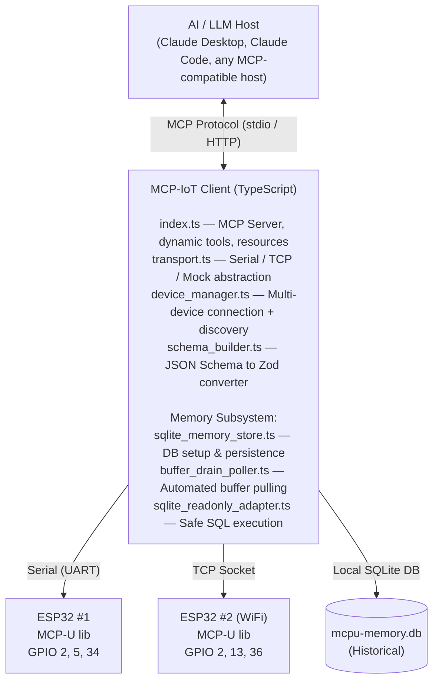
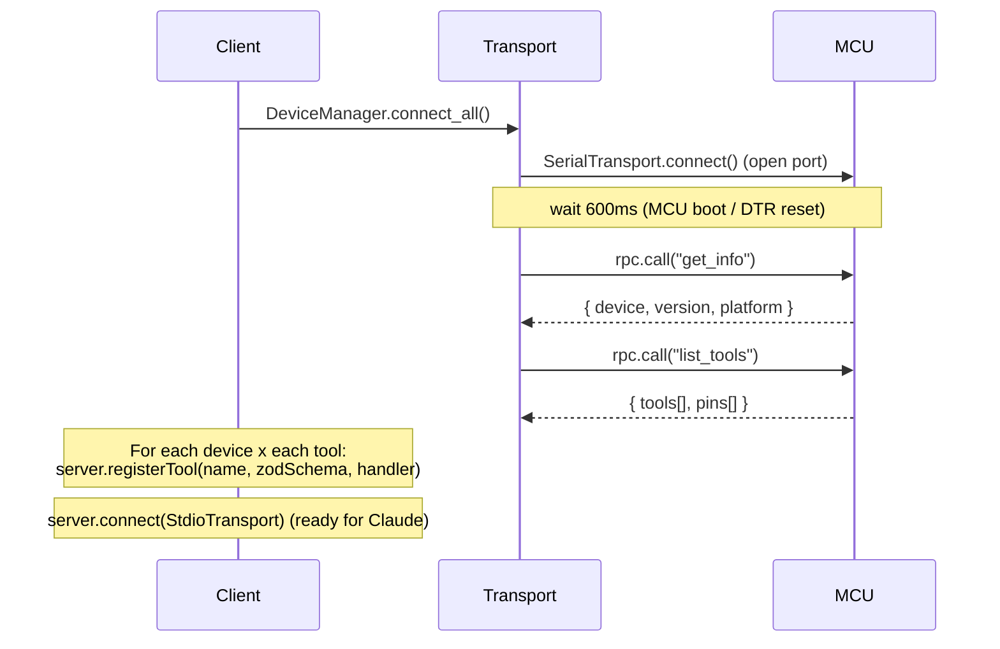
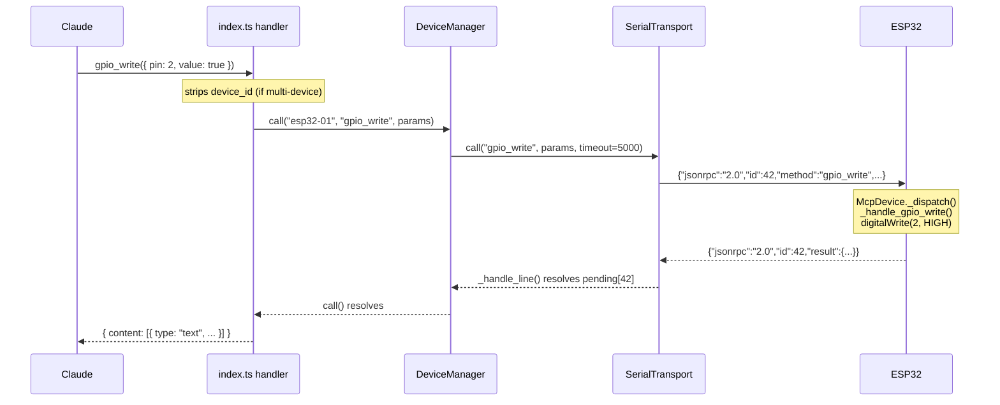

# Architecture

## System Overview

---

## Component Responsibilities

### Firmware (`MCP-U` library)

- Listens on any Arduino `Stream` for newline-delimited JSON-RPC requests
- Maintains a pin registry (type, name, description, capabilities, sampling rates)
- Dispatches to built-in handlers (`gpio_write`, `gpio_read`, `get_pin_buffer`, etc.)
- Dispatches to user-registered custom tools
- Sends `list_tools` discovery response including full JSON Schema for all tools

### `transport.ts`

- `SerialTransport` — wraps `serialport` library, ReadlineParser for `\n` framing
- `TcpTransport` — wraps Node.js `net.Socket`, manual line buffering
- `MockTransport` — simulates a connected device for testing without physical hardware
- All share: pending promise map, request ID counter, timeout logic, disconnect event

### `device_manager.ts`

- Instantiates the correct transport per device config
- Calls `get_info` + `list_tools` on connect
- Caches: `info`, `pins[]`, `tools[]` per device
- Routes `call(device_id, method, params)` to correct transport

### `schema_builder.ts`

- Converts firmware `inputSchema` (JSON Schema) to Zod shape
- Maps: `integer → z.number().int()`, `boolean → z.boolean()`, `string → z.string()`, `number → z.number()`
- Handles `required` → optional fields
- Intentionally minimal (flat schemas only)

### `memory/` (Buffered Pull Memory Subsystem)

- `sqlite_memory_store.ts` — Manages the SQLite database connection, schema, batch inserts, tool calls, and data retention cleanup.
- `buffer_drain_poller.ts` — Identifies pins with `buffer: true` capabilities and dynamically calculates safe polling intervals to drain MCU ring buffers before they overflow.
- `buffer_expander.ts` — Parses bulk buffer arrays from the MCU and infers timestamps for each sample.
- `sqlite_readonly_adapter.ts` + `sql_guard.ts` — Provides a safe, restricted interface allowing the LLM to query historical observations using only `SELECT` or `WITH` SQL commands.

### `index.ts`

- Loads device config (env var or `devices.json`)
- Boots `DeviceManager` and `Memory Subsystem`
- Registers static meta-tools `list_devices`, `sql_readonly_query`, and `memory_status`
- Loops over all devices × all tools → `server.registerTool()` dynamically
- Registers MCP Resources: `mcu://devices`, `mcu://{device_id}/pins`, `mcu://cache/*`

---

## Discovery Sequence

---

## Data Flow — Single Tool Call

---

## Why This Design

| Decision | Rationale |
|----------|-----------|
| UART-first transport | Lowest latency, no network stack, works when WiFi is unavailable |
| Arduino `Stream` abstraction | One firmware API works for Serial, WiFiClient, BluetoothSerial |
| JSON-RPC 2.0 | Standard protocol with error codes, ID tracking, tooling support |
| Self-describing firmware | Client never hardcodes tool names — adding firmware tools is automatic |
| Zod schemas from JSON Schema | MCP SDK requires Zod; firmware returns JSON Schema — thin bridge needed |
| `device_id` as Zod literal | Prevents Claude from calling wrong device, no runtime lookup needed |
